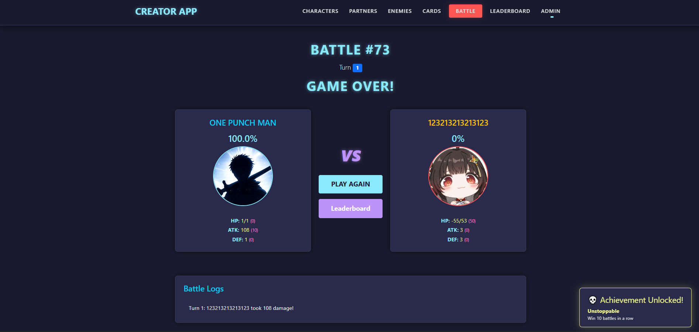
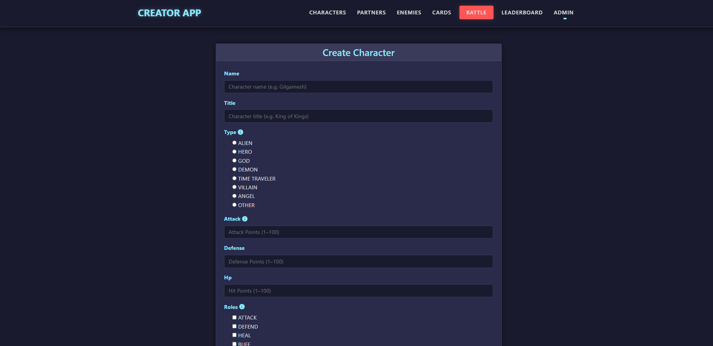
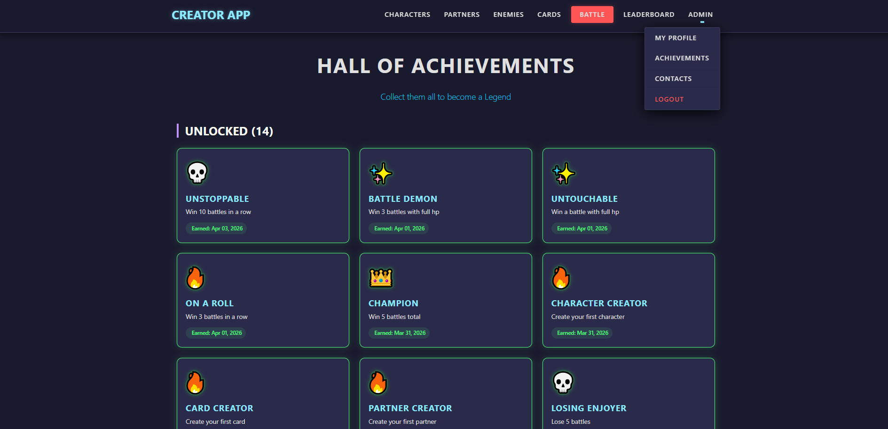
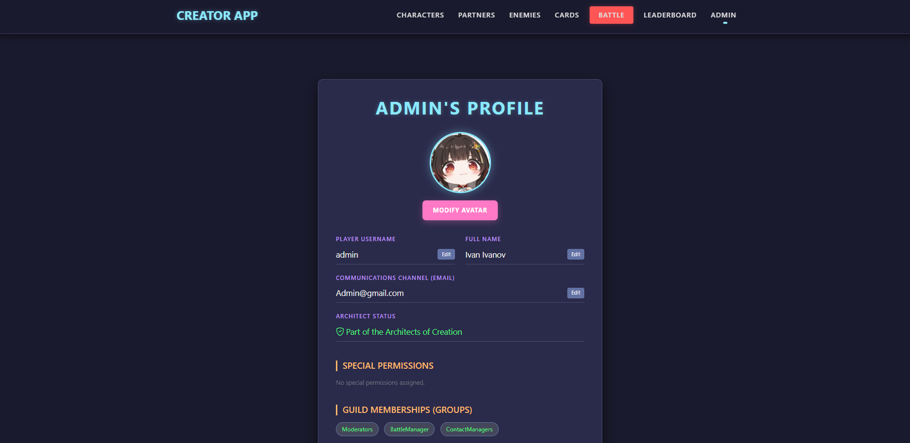
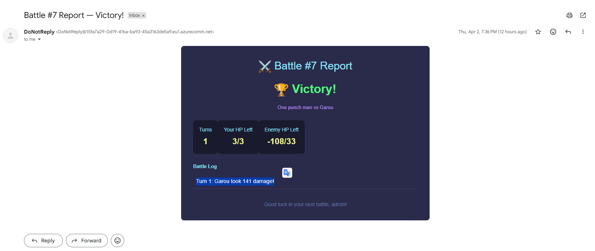

# A Django app for a turn-based battle game where users create their own characters and enemies.


# Find the project here:

[CreatorApp](https://creatorapp-cagtbxfsemaca3bd.spaincentral-01.azurewebsites.net/ "Try the app here") 


# Why This Project Exists

```
This project was built to demostrate my experience with Django and PostgreSQL , 
speciffically database design and relationships,implementing simple CRUD operations, 
implementing forms , data validation , Django class  based views , 
templates with dynamic data rendering.
```

# Features

- Turn based combat with attacks , heals and buffs

- CRUD operations on all characters,partners , enemies and cards

- Stat, role and type selection on creation that involves strategy to make your characters the strongest
- 2 vs 1 battle between Character and their Partner against strong Enemy with battle logs
- Contact form, about , wip , maintenance, leaderboard, profile , achievements , contacts , custom error and custom profile picture , username , full name , email and password change pages
- AI generated frontend design with the help of Gemini CLI



# App responsibilities

- common - stores in one place models,choice fields and custom tags that are used in all other apps. Contains the home,wip,about,maintenance,delete confirm and no permission pages.
- characters - handles everything about character creation,edit and deletion and contains the landing page.
- partners - handles everything about partner creation,edit and deletion.
- enemies - handles everything about enemy creation,edit and deletion.
- contacts - handles the display of a contact form page. Users in group ContactManagers can access special page to resolver inquiries.
- battle - handles the process of selecting characters,partners and enemies to fight each other. Then handles the creation of the battle and stores the character and enemy adjusted stats into a temporary model only for the current fight.Handles the fight logic.
- cards - handles everything about creation , edit and deletion of cards that users can apply on their creations for a fresh look.
- accounts - handles everything about account creation ,authentication and authorization.
- achievements - uses async functions to find if users met achievement conditions and awards them.



# Project Notes

- Battle is turn based and you are always first. You always have the option to attack and every few turns to  buff or heal yourself. Enemies can only attack.
- The defense stat is how much you get healed for instead of being used to reduce damage.
- Different Types and Roles buff your character stats when entering combat which allows them to reach higher than the set amount on creation.
- Enemy weakness reduces the enemy stats depending on the character they fight.
- Partners only function currently is to add their stats to their character partner on game start.
- There is leaderboard that shows top 10 users and their winrate.
- On a battle win you receive an Email with battle results if you added your Email on account creation. It uses Celery and Redis for that task and only works on the deployed version of the project.


# Tech Stack

- Backend: Python , Django , Django REST Framework
- Database: PostgreSQL
- Task Queue: Celery + Redis
- Message Broker: Redis
- Deployment: Azure App Service / Azure Database / Azure Email Communication Service

# Installation 

- ! Important note: The project uses different settings file  locally and in production. Both can be found in CreatorApp/settings

1. Clone the repository

```bash

git clone https://github.com/Ivanivanov-it/CreatorApp.git
cd CreatorApp
```

2. Create virtual environment

```bash

python -m venv venv
source venv/bin/activate # Linux/Mac
venv\Scripts\activate # Windows
```

3. Install dependencies

```bash

pip install -r requirements.txt
```

4. Configure environment variables

The cloudinary credentials are not hidden on purpose for the sake of the exam.

Create .env file in the project root or use the provided .env.example:

```
SECRET_KEY=generate_your_own_key
DJANGO_SETTINGS_MODULE=CreatorApp.settings.local
DEBUG="True"
ALLOWED_HOSTS=localhost,127.0.0.1
DB_PORT=5432
DB_NAME=your_db
DB_USER=your_user
DB_PASSWORD=your_password
DB_HOST=127.0.0.1
MAINTENANCE="False"

```

Use this command to generate your own secret key:

```bash

python -c "from django.core.management.utils import get_random_secret_key; print(get_random_secret_key())"
```

5. Run migrations

```bash

python manage.py migrate
```

6 Start server

```bash

python manage.py runserver
```

7. To run tests 
```bash
export DJANGO_SETTINGS_MODULE=CreatorApp.settings.local
python manage.py test
```
