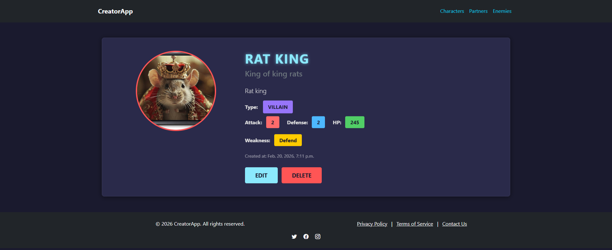

# A Django app for a turn-based battle game where users create their own characters and enemies.

# Why This Project Exists

```
This project was built to demostrate my experience with Django and PostgreSQL , 
speciffically database design and relationships,implementing simple CRUD operations, 
implementing forms , data validation , Django class and function based views , 
templates with dynamic data rendering.
```

# Features

- Really simple (for now) turn based battle system

- CRUD operations on all characters,partners and enemies

- Stat, role and type selection on creation that involves strategy to make your characters the strongest
- 2 vs 1 battle between Character and their Partner against strong Enemy with battle logs
- Contact form, about page , WIP page, 404 page
- AI generated frontend design with the help of Gemini CLI

# Tech Stack

- Python
- Django
- PostgreSQL

# Installation 

1. Clone the repository

```bash

git clone https://github.com/Ivanivanov-it/CreatorApp.git
cd CreatorApp
```

2. Create virtual environment

```bash

python -m venv venv
source venv/bin/activate # Linux/Mac
venv\Scripts\activate # Windows
```

3. Install dependencies

```bash

pip install -r requirements.txt
```

4. Configure environment variables

Create .env file in the project root:

```
SECRET_KEY=generate_your_own_key
DEBUG=False

DB_PORT=5432
DB_NAME=your_db
DB_USER=your_user
DB_PASSWORD=your_password
DB_HOST=127.0.0.1
```

Use this command to generate your own secret key:

```bash

python -c "from django.core.management.utils import get_random_secret_key; print(get_random_secret_key())"
```

5. Run migrations

```bash

python manage.py migrate
```
5. Populate the database

```bash

python populate_db.py
```

7. Start server

```bash

python manage.py runserver
```